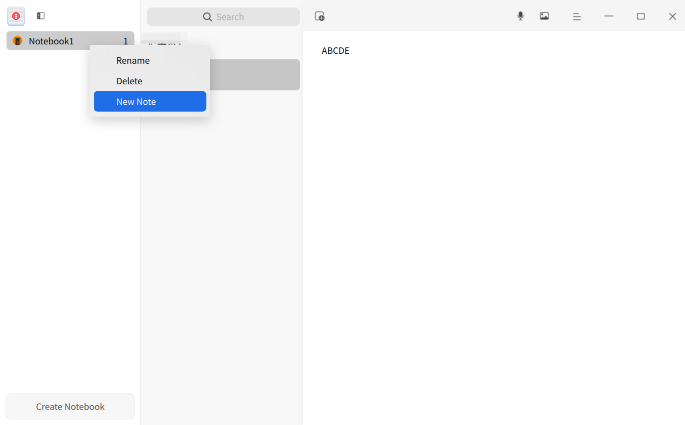
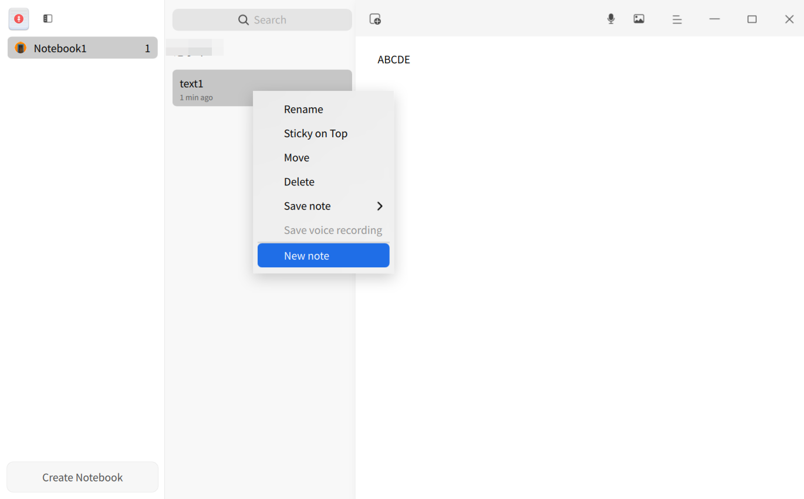
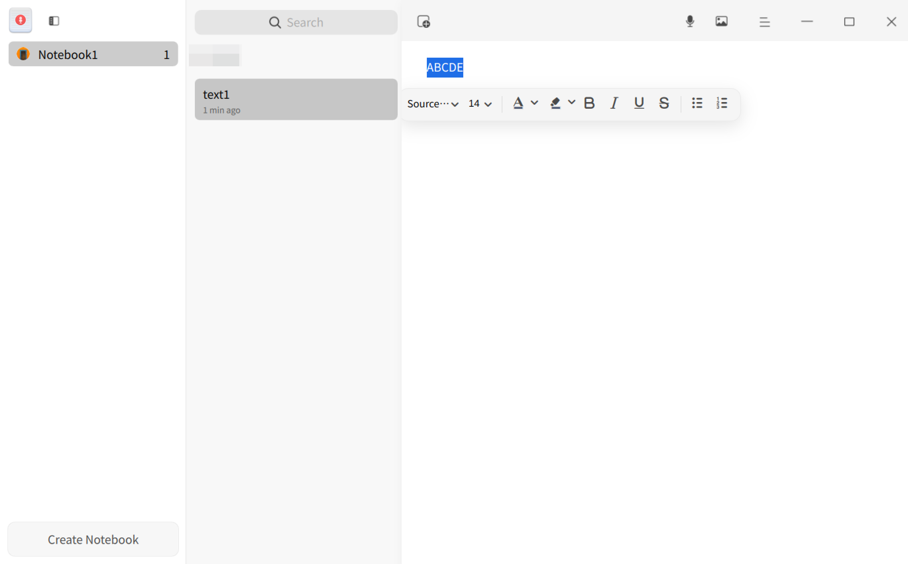
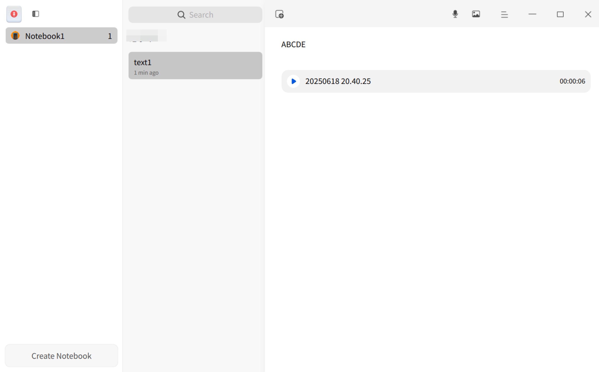
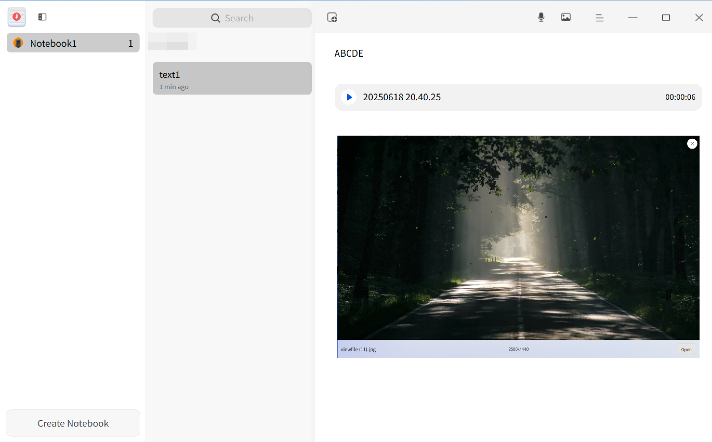
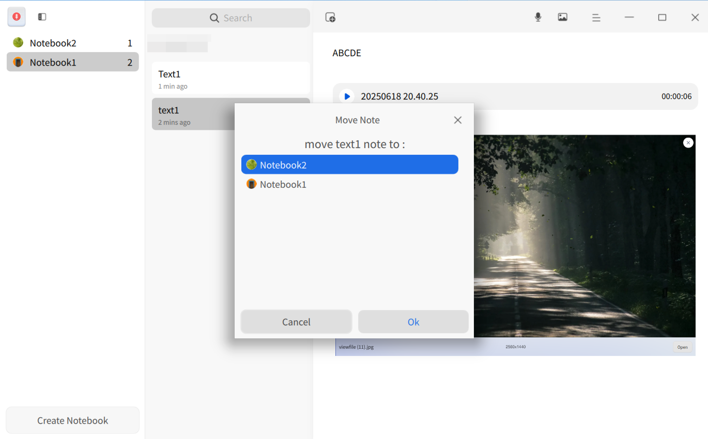
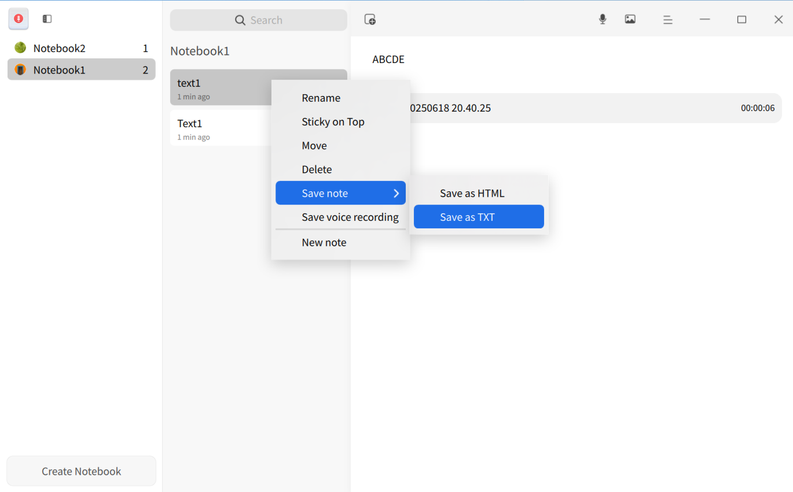
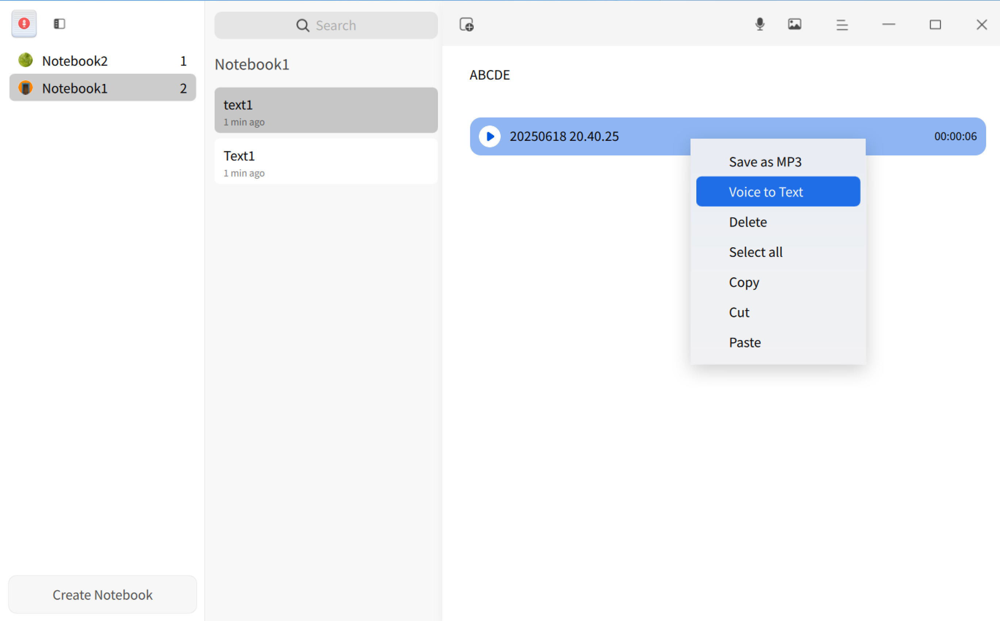

# Voice Notes|deepin-voice-note|

## Overview

Voice Notes is a note-taking software that integrates voice and text, commonly used to record daily life or work matters.

## Getting Started

Run, close Voice Notes, or create shortcuts through the following methods.

### Run Voice Notes

1. Click the Launcher icon  on the taskbar to enter the Launcher interface.
2. Scroll the mouse wheel or search to find the Voice Notes icon , then click to run.
3. Right-click  to:
   - Click **Send to Desktop** to create a desktop shortcut.
   - Click **Pin to Taskbar** to pin the application to the taskbar.
   - Click **Startup Automatically** to add the application to startup items, automatically running it when the computer boots.

### Close Voice Notes

- Click  in the Voice Notes interface to exit.
- Right-click  on the taskbar and select **Close All**.
- Click  in the Voice Notes interface and select **Exit**.

### View Shortcuts

Use the shortcut **Ctrl + Shift + ?** to open the shortcut preview. Mastering shortcuts will significantly improve efficiency.

## Notebook Management

### Create Notebook

- When no notebooks exist, click **New Notebook** to create one.
- Below the notebook list, click **New Notebook** to create a new notebook.

>  Tip: Drag notebooks to reorder; click  to hide/show the notebook list.

### Rename Notebook

1. Double-click a notebook or right-click and select **Rename**.
2. Enter a new name in the text box.
3. Click a blank area or press **Enter** to confirm.

### Delete Notebook

1. Select a notebook in the notebook list.
2. Right-click and select **Delete** or press **Delete**.
3. Confirm deletion in the dialog.

## Note Management

### Create Note

- After creating your first notebook, a default note is created. Click  to add more notes.
- Right-click a notebook/note and select **New Note**.

#### Add Text to Note

1. Select a note in the note list.
2. Click the detail area and enter text.
3. Select text to access formatting tools: font, size, color, bold, etc.

#### Add Voice to Note

1. Select a note in the note list.
2. Click the record button .
3. Click  to finish recording (max 60 minutes).
   
   >  Note: Click  to pause;  to resume.
4. Click  to playback.

#### Add Image to Note

Add images via:
- Click  > select image.
- Drag image to detail area.
- Copy-paste image.

### Rename Note

1. Double-click a note or right-click and select **Rename**.
2. Enter a new name.
3. Click a blank area or press **Enter**.

### Search Notes

1. Click  in the search box.
2. Enter keywords and press **Enter**.
3. Click  to clear/cancel search.

### Move Notes

Select one/multiple notes (Ctrl/Shift), then:
- Drag to another notebook.
- Right-click > **Move** > select target notebook.

### Pin Notes

1. Right-click a note.
2. Select **Pin to Top**.

   Right-click pinned note > **Unpin**.

### Save Notes

1. Select one/multiple notes.
2. Right-click > **Save Note** > **Save as HTML** or **Save as TXT**.

   > Note:
   >- TXT: Saves text/voice metadata (no audio/images).
   >- HTML: Saves text/images (no audio).

### Save Voice

1. Select one/multiple voice notes.
2. Right-click > **Save Voice** (saves as MP3).

>  Tip: Right-click a single voice file > **Save as MP3**.

### Voice to Text

1. Select a voice file.
2. Right-click > **Voice to Text** (converts to text).

### Text to Speech

1. Select text > right-click > **Text to Speech**.
2. Click close button  to stop.

> Note:
>- Grayed out if no text selected.
>- Works only on converted text (not raw audio).

### Voice Dictation

1. Place cursor > right-click > **Voice Dictation** (speech-to-text).
2. Click close button  to stop.

> Tip: Can be used while recording.

### Delete Note

1. Select one/multiple notes.
2. Right-click > **Delete** or press **Delete**.
3. Confirm deletion.

### Delete Voice

1. Select a voice file.
2. Right-click > **Delete** or press **Delete**.

## Main Menu

Set audio source, view privacy policy, switch themes, view help, etc.

### Settings

Set audio source:
- **System Sound**: Records internal audio only.
- **Microphone**: Records mic input only.

1. Click .
2. Select audio source.

### Privacy Policy

1. Click .
2. Select **Privacy Policy** to view.

### Theme

Switch themes (Light/Dark/System):
1. Click .
2. Select **Theme**.

### Help

View help manual:
1. Click .
2. Select **Help**.

### About

View version/info:
1. Click .
2. Select **About**.

### Exit

Quit Voice Notes:
1. Click .
2. Select **Exit**.