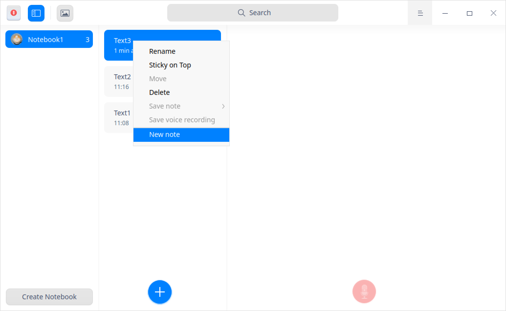
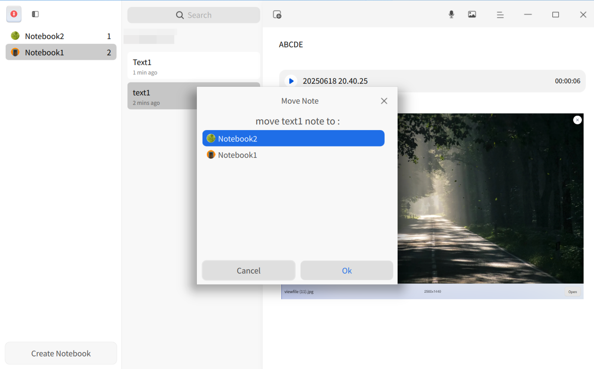
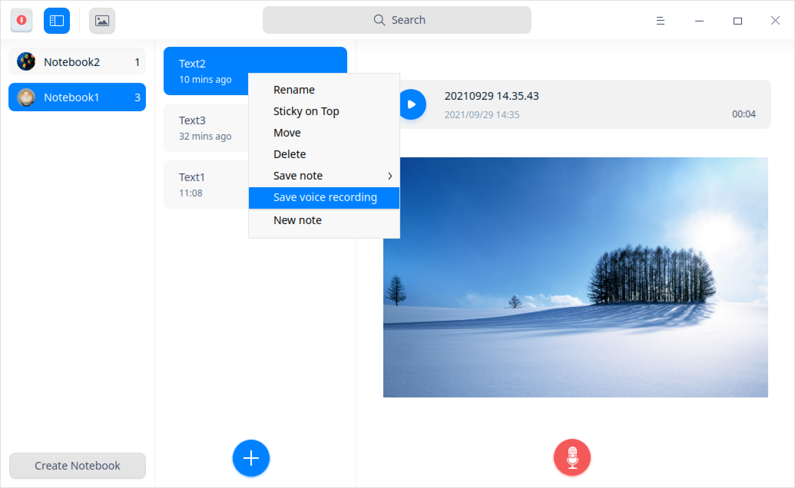
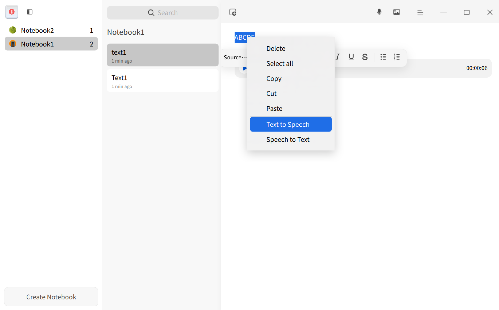
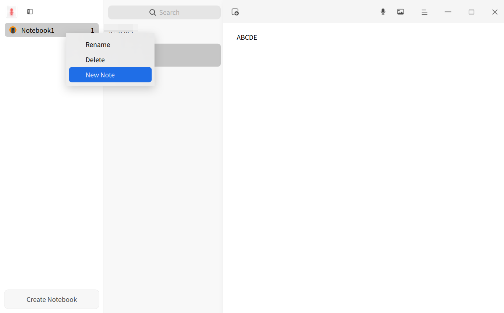

# Voice Notes|deepin-voice-note|

## Overview

Voice Notes is a simple memo software with texts and voice recordings. With it, you are able to record your daily life and work in MP3 format or texts. 

## Guide

You can run, exit, and create a shortcut for Voice Notes in the following ways.

### Run Voice Notes

1. Click the Launcher icon  in the dock to enter the Launcher interface.
2. Locate  by scrolling the mouse wheel or searching "voice notes" in the Launcher interface, and click it to run.
3. Right-click , and you can:
   - Click **Send to desktop** to create a desktop shortcut.
   - Click **Send to dock** to fix it in the Dock.
   - Click **Add to startup** to add the application to startup, and it will automatically run when the system starts up.

### Exit Voice Notes

- Click  on the Voice Notes interface to exit Voice Notes.
- Right-click  in the dock, and select **Close All** to exit.
- Click  on the Voice Notes interface, and select **Exit** to exit.

### View Shortcuts

On the Voice Notes interface, press **Ctrl** + **Shift** + **?** on the keyboard to view shortcuts. Proficiency in shortcuts will greatly improve your efficiency.

## Operations

### Create Notebooks

- Click **Create Notebook** to create a new notebook when there is none in Voice Notes.
- Click **Create Notebook** under the notebook list to create a new notebook. 

>Tips: You can change the notebook order by dragging the notebook in the notebook list.

### Create Notes

1. When a notebook is created in Voice Note, a text is also created by default. Click the  icon under the notes list to create more new notes.
2. Right-click a notebook or note and select **New Note** to create a new note.

### Add Text Notes

Select a text note in the note list, place the cursor in the right column and click to enter the text notes.

### Add Voice Notes

1. Select a text note on the Voice Notes interface and click  the  icon  in its right column to start recording.

2. Click the  icon to finish recording.

> Notes: Click the icon to pause recording during the recording process, and click  again to resume recording. The maximum recording time is 60 minutes.  

3. Click the icon to listen to the playback after the recording is completed.

### Search Voice Notes

1. In the search box located in the top center area of the Voice Notes interface, you can click  to enter keywords.
2. Press the **Enter** key on the keyboard to fast locate it.
3.  Click  in the search box  to clear the current keywords or cancel the search. 

### Move Voice Notes

Select a text note or multiple text notes with **Ctrl/Shift** in the text note list and move the notes as needed in the following ways:

- Drag the notes to another notebook.
- Right-click to select **Move**, select a notebook in the pop-up dialogue and click **Confirm** to move the text notes in the selected notebook.

### Stick Voice Notes on Top

1. Right-click a note in the note list.

2.  Select **Sticky on Top** to place the note on top.

   Right-click the note and select **Unstick** to undo the former operation.

### Convert Voices to Texts

1. Select a voice file on the Voice Notes interface.
2. Right-click, and select **Voice to Text**.

### Save Voice Recording

1.   Select a voice note or multiple voice notes with **Ctrl/Shift** in the text note list.
2.   Right-click, and select **Save voice recording** to save the voice notes selected to the specified storage device.

> Tips:  You can also right-click a voice file in the voice notes and select **Save as MP3** to save it in the storage device.

### Save as TXT

1.  Select a text note or multiple text notes with **Ctrl/Shift** in the text note list.
2.  Right-click, and select **Save as TXT**.
3.  Save the text note to the storage device in TXT format.

### Text to Speech

1. Go to **Control Center** > **Assistive Tools**, and enable **Text to Speech**.
2. Select a paragraph of text on the Voice Notes interface, and right-click to select **Text to Speech**. The text selected will be converted to speech and read accordingly. 
3. In the Text to Speech mode, right-click to select **Stop reading** or left-click to stop reading.

 > Notes:
 >- When no text is selected, **Text to Speech** is grayed out and inoperable. 
 >- When only an audio file is selected, **Text to Speech** is inoperable; if the audio file selected contains voice-to-text content, **Text to Speech** can be operated.

### Speech to Text

1. Go to **Control Center** > **Assistive Tools**. Enable **Speech to Text**, and select **Language**.
2. In the text input box on the Voice Notes interface, right-click and select **Speech to Text**. Now you can input audios via microphone, and the translated text will be edited and displayed in the text input box. 
3. In the Speech to Text mode, click the the blank area on the Voice Notes interface to stop text editing and display. 

>  Tips: You can enable **Speech to Text** while recording audios. 

### Translate Text Notes

1. Go to **Control Center** > **Assistive Tools**. Enable **Translation**, and select the **Language** option from **en-cn** or **cn-en**.
2. Select a paragraph of text on the Voice Notes interface, and right-click to select **Translate**. The text selected will be translated to target language.

>  Notes: When only an audio file is selected, **Translate** is inoperable; if the audio file selected contains voice-to-text content, **Translate** can be operated.

### Rename Notebooks

The notebook created will be automatically saved as **Note (n)**. You can rename it in the following steps. 

1. On the Voice Notes interface, right-click a notebook.
2. Select **Rename**.
3. Enter the file name.
4. Click in the blank area on the interface, or press the **Enter** key on the keyboard to rename it.

>  Tips: You can also rename each text note under a notebook. 

### Delete Notebooks

1. Select a notebook on the Voice Notes interface.
2. Right-click, and select **Delete** or press the **Delete** key on the keyboard.
3. Click **Confirm** in the pop-up prompt box.

### Delete Text Notes

1.   Select a text note or multiple text notes in the text note list with **Ctrl/Shift**.
2.  Right-click, and select **Delete** or press the **Delete** key on the keyboard.
3.  Click **Confirm** in the pop-up prompt box.

### Delete Voice Notes

1.  Select a voice file on the Voice Notes interface.
2.  Right-click, and select **Delete** or press the **Delete** key on the keyboard.
3.  Click **Confirm** in the pop-up prompt box.

## Main Menu

On the main menu, you can set audio source, check privacy policy, switch window themes, view help manual, and get more information about Voice Notes.

### Settings

You can set up audio source from **Internal** and **Microphone** (default) options.
1. On the Voice Notes interface, click .
2. Set up audio source:
   - Select **Internal** source, and only system built-in sound will be recorded. 
   - Select **Microphone** source, and only microphone sound will be recorded. 

### Privacy Policy

1. On the Voice Notes interface, click .
2. Click **Privacy Policy** to view the relevant content on privacy policies.

### Theme

The window theme provides three theme types, namely Light Theme, Dark Theme, and System Theme.
1. On the Voice Notes interface, click .
2. Click **Theme** to select one theme.

### Help

1. On the Voice Notes interface, click .
2. Click **Help** to view the manual of Voice Notes.

### About

1. On the Voice Notes interface, click . 
2. Click **About** to view the version and introduction of Voice Notes.

### Exit

1. On the Voice Notes interface, click .
2. Click **Exit** to exit Voice Notes.
