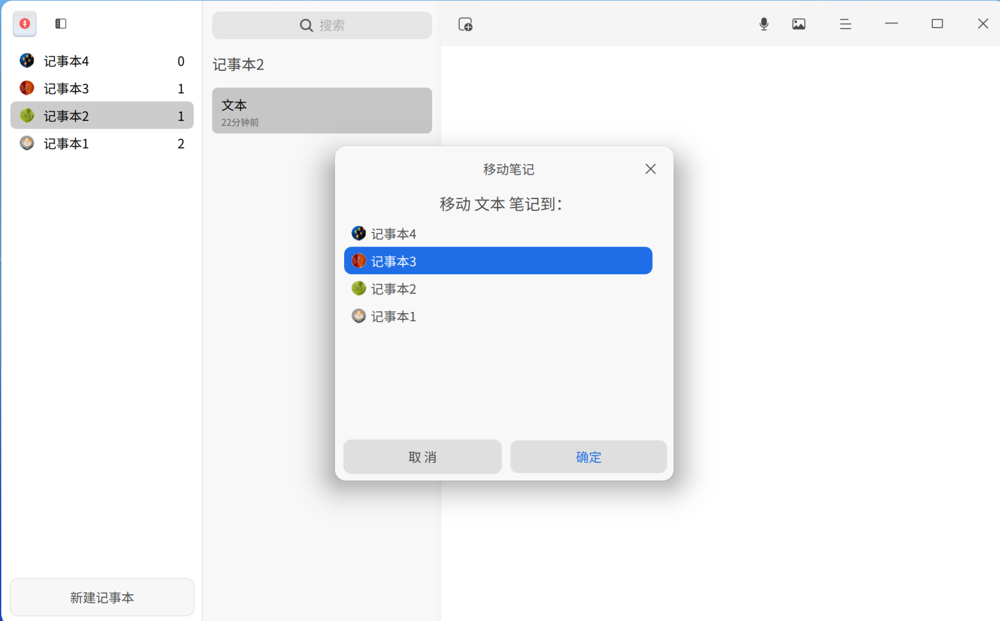
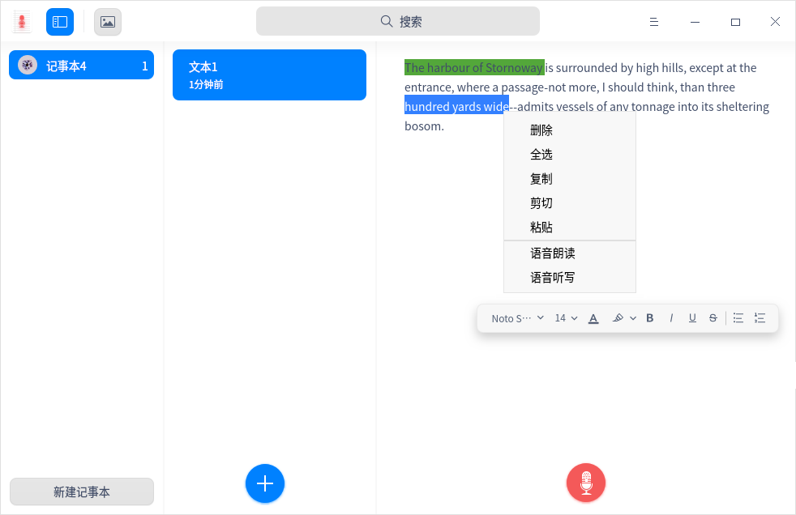

# 语音记事本|deepin-voice-note|

## 概述

语音记事本是一款集语音、文字于一体的记事软件，一般用来记录生活日常或工作事项。

## 使用入门

通过以下方式运行、关闭语音记事本，同时还可以创建快捷方式。

### 运行语音记事本

1. 单击任务栏上的启动器图标 ，进入启动器界面。
2. 上下滚动鼠标滚轮浏览或通过搜索，找到语音记事本图标 ，单击运行。
3. 右键单击 ，您可以：

   - 单击 **发送到桌面**，在桌面创建快捷方式。
   - 单击 **发送到任务栏**，将应用程序固定到任务栏。
   - 单击 **开机自动启动**，将应用程序添加到开机启动项，在电脑开机时自动运行该应用。

### 关闭语音记事本

- 在语音记事本界面点击 ，退出语音记事本。
- 在任务栏右键单击 ，选择 **关闭所有**，退出语音记事本。
- 在语音记事本界面点击 ，选择 **退出**，退出语音记事本。

### 查看快捷键

在语音记事本界面，使用快捷键 **Ctrl + Shift + ?** 打开快捷键预览界面。熟练地使用快捷键，将大大提升您的操作效率。

## 操作介绍

### 新建记事本

- 当语音记事本中尚无记事本时，单击 **新建记事本**，创建一个新的记事本。
- 在记事本列表下方，单击 **新建记事本**，创建一个新的记事本。

> 窍门：您可以在记事本列表中拖拽记事本来调整顺序。

### 新建笔记

- 当第一次新建记事本后，系统默认创建一个笔记，在笔记列表内单击按钮  可继续创建新的笔记。
- 右键单击记事本或笔记，选择 **新建笔记** 来创建一个新笔记。

### 添加文字笔记

1. 在笔记列表中，选择一个笔记。
2. 将光标移入右侧详情页内，单击鼠标左键后输入文字笔记。

### 添加语音

1. 在语音记事本界面上，选择一个笔记。
2. 在右侧详情页内单击按钮 ，添加语音。
3. 单击按钮  完成语音录制。
   
   > 说明：添加语音的过程中您可以单击按钮  暂停录音，再次单击按钮  继续录音。录音的限制时长为60分钟。
3. 录制完成后，单击按钮  可以回放语音。

### 搜索

1. 在语音记事本顶部搜索框中，单击 ，输入关键字。
2. 按下键盘上的 **Enter** 键搜索结果。
3. 在搜索框中单击  清除当前输入的关键字或取消搜索。

### 移动笔记
在某记事本的笔记列表中，选择一个笔记或按下 **Ctrl/Shift** 键选择多个笔记，可以采用以下方法之一移动笔记。
- 按住鼠标左键将笔记拖拽到另一个记事本中。
- 单击鼠标右键选择 **移动**，在弹出的对话框中选择一个记事本，单击 **确定**，该笔记会移到所选的记事本中。

### 置顶笔记

1. 在笔记列表中，右键单击笔记。

2. 选择 **置顶**，该笔记会排在笔记列表最前面。

   右键单击已置顶的笔记，选择 **取消置顶**。

### 语音转文字

1. 在语音记事本界面上，选择一个语音文件。
2. 单击鼠标右键选择 **语音转文字**。

### 保存语音

1. 在笔记列表中，选择一个语音笔记或按下 **Ctrl/Shift** 键选择多个语音笔记。
2. 单击鼠标右键，选择 **保存语音**，选中的语音笔记则保存至储存设备中。

> 窍门：您也可以选择语音笔记中某一个语音文件，右键单击选择 **保存为MP3** ，该语音文件则保存至储存设备中。

### 保存为TXT文件

1. 在笔记列表中，选择一个文字笔记或按下 **Ctrl/Shift** 键选择多个文字笔记。
2. 单击鼠标右键，选择 **保存为TXT**，选中的文字笔记则保存至储存设备中。

### 语音朗读

在“控制中心” > “辅助功能”中开启语音朗读后，可执行以下操作。

1. 在语音记事本界面选中一段文字，单击右键选择 **语音朗读**，语音播报选中的文字。

2. 在语音朗读模式下，单击右键选择 **停止朗读** 或者单击左键停止朗读。

>说明：
>- 当未选中文字时，语音朗读呈置灰状态，不可操作。
>- 当只选中语音文件时，语音朗读不可操作；若语音文件已转为文字，可选中文字内容进行语音朗读的操作。

### 语音听写

在“控制中心” > “辅助功能”中开启语音听写并选择语言后，可执行以下操作。

1. 在语音记事本界面右侧详情页内，单击鼠标右键选择 **语音听写**，通过麦克风输入语音，转译文字将被编辑在详情页内。

2. 在听写模式下单击界面空白区域停止语音听写。

>窍门：录制语音时可同时开启语音听写的功能。

### 文本翻译

在“控制中心” > “辅助功能”中开启文本翻译并选择语言后，可执行以下操作。

1. 在语音记事本界面选中一段文字。
2. 单击鼠标右键选择 **文本翻译**，选中的文字将被翻译成目标语言。
>说明：当只选中语音文件时，文本翻译不可操作；若选中的语音文件包含语音转文字内容，可进行文本翻译的操作。

### 重命名记事本

新建记事本后，将自动命名为“记事本（n）”，您可以重命名记事本。

1. 在记事本列表中，右键单击记事本。
2. 选择 **重命名**。
3. 输入新的名称。
4. 单击界面空白处或者按下键盘上的 **Enter** 键完成重命名。

> 窍门: 您也可以对记事本下的各个笔记进行重命名。

### 删除记事本

1. 在记事本列表中，选择一个记事本。
2. 单击鼠标右键选择 **删除** 或按下键盘上的 **Delete** 键。
3. 在弹出的对话框中，单击 **确定**。

### 删除笔记

1. 在笔记列表中，选择一个笔记或按下 **Ctrl/Shift** 键选择多个笔记。
2. 单击鼠标右键选择 **删除** 或按下键盘上的 **Delete** 键。
3. 在弹出的对话框中，单击 **确定**。

### 删除语音

1. 在语音记事本界面上，选择一个语音文件。
2. 单击鼠标右键选择 **删除** 或按下键盘上的 **Delete** 键。
3. 在弹出的对话框中，单击 **确定**。

## 主菜单

在主菜单中，您可以设置声音来源、查看隐私政策、切换窗口主题、查看帮助手册，了解语音记事本的更多信息。

### 设置

您可对声音来源进行设置，包含系统声音和麦克风声音。

1. 在语音记事本界面，单击 。
2. 设置声音来源：
   - 选择 **系统声音**，录音时只录制系统内置声音。
   - 选择 **麦克风声音**，录音时只录制麦克风声音。

### 隐私政策

1. 在语音记事本界面，单击 。
2. 选择 **隐私政策**，打开隐私政策链接并查看相关内容。

### 主题

窗口主题包含浅色主题、深色主题和系统主题。

1. 在语音记事本界面，单击 。
2. 选择 **主题**，选择一个主题颜色。

### 帮助

查看帮助手册，进一步了解和使用语音记事本。

1. 在语音记事本界面，单击 。
2. 选择 **帮助**。
3. 查看语音记事本的帮助手册。

### 关于

1. 在语音记事本界面，单击 。
2. 选择 **关于**。
3. 查看语音记事本的版本和介绍。

### 退出

1. 在语音记事本界面，单击 。
2. 选择 **退出**。

