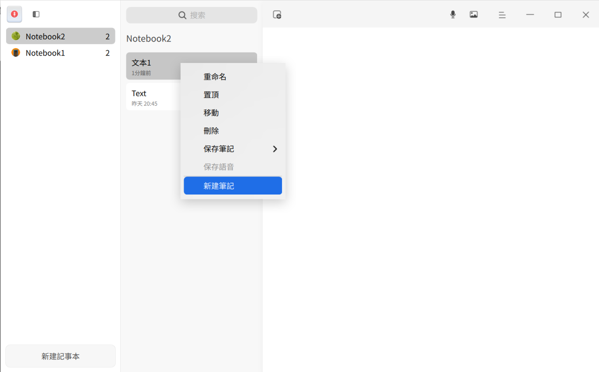
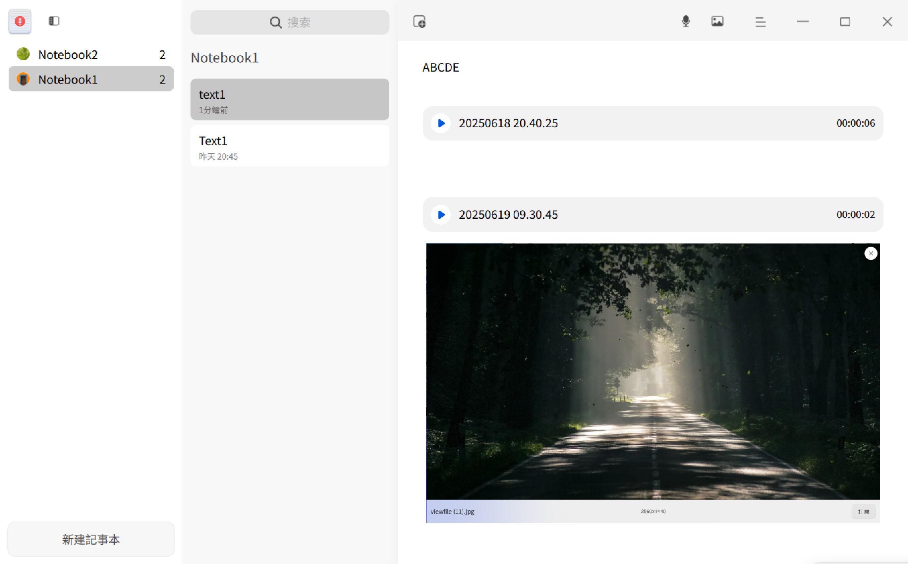
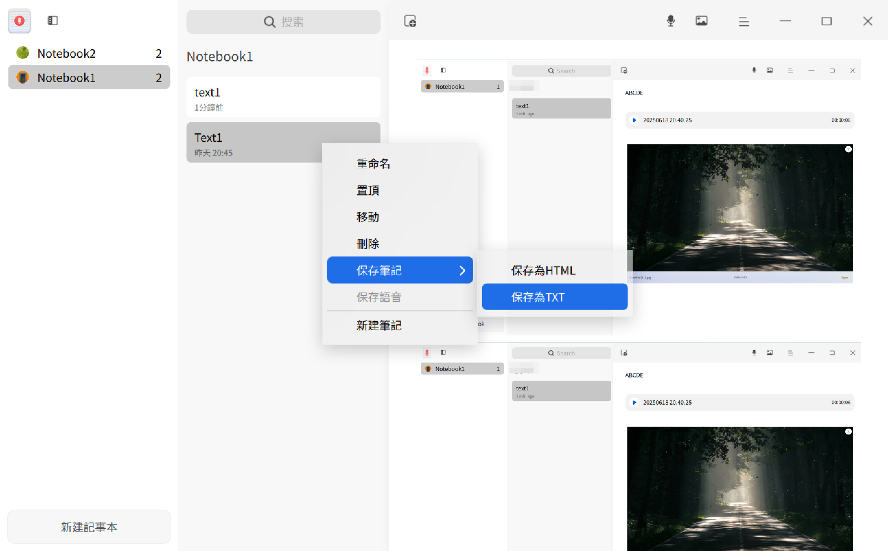
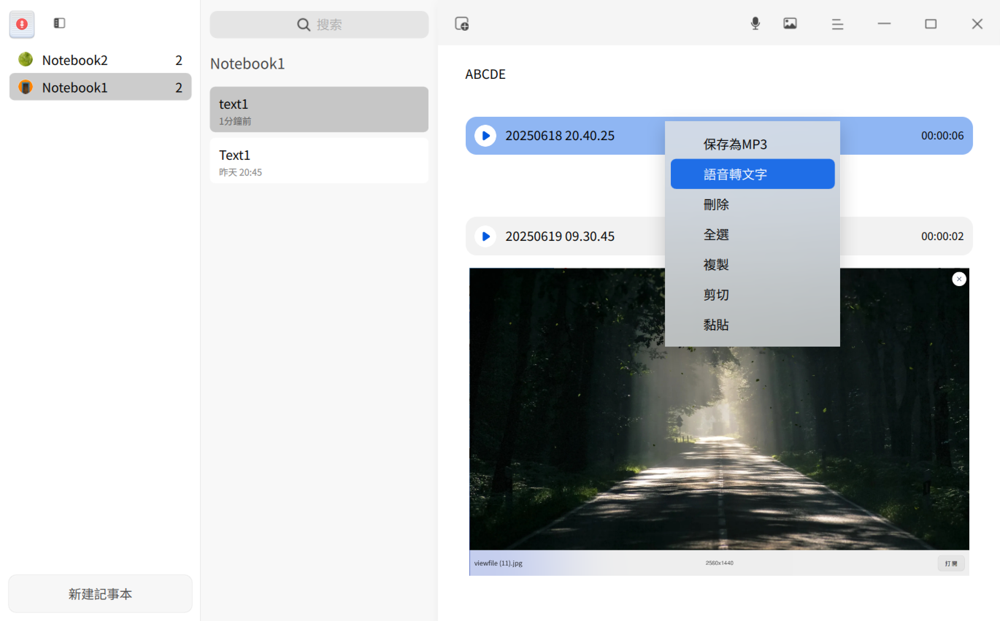
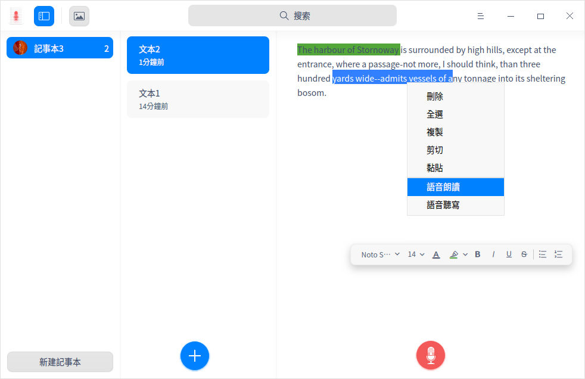

# 語音記事本|deepin-voice-note|

## 概述

語音記事本是一款集語音、文字於一體的記事軟件，一般用來記錄生活日常或工作事項。

## 使用入門

通過以下方式運行、關閉語音記事本，同時還可以創建快捷方式。

### 運行語音記事本

1. 單擊任務欄上的啟動器圖標 ，進入啟動器界面。
2. 上下滾動鼠標滾輪瀏覽或通過搜索，找到語音記事本圖標 ，單擊運行。
3. 右鍵單擊 ，您可以：

   - 單擊 **發送到桌面**，在桌面創建快捷方式。
   - 單擊 **發送到任務欄**，將應用程序固定到任務欄。
   - 單擊 **開機自動啟動**，將應用程序添加到開機啟動項，在電腦開機時自動運行該應用。

### 關閉語音記事本

- 在語音記事本界面單擊 ，退出語音記事本。
- 在任務欄右鍵單擊 ，選擇 **關閉所有**，退出語音記事本。
- 在語音記事本界面單擊 ，選擇 **退出**，退出語音記事本。

### 查看快捷鍵

在語音記事本界面，使用快捷鍵 **Ctrl + Shift + ?** 打開快捷鍵預覽界面。熟練地使用快捷鍵，將大大提升您的操作效率。

## 記事本管理

### 新建記事本

- 當語音記事本中尚無記事本時，單擊 **新建記事本**，創建一個新的記事本。
- 在記事本列表下方，單擊 **新建記事本**，創建一個新的記事本。

>  竅門：您可以在記事本列表中拖拽記事本來調整順序；單擊菜單欄中的圖標  可以隱藏記事本列表，再次單擊顯示記事本列表。

### 重命名記事本

1. 在記事本列表中，雙擊記事本或者在右鍵菜單中選擇 **重命名**。
3. 在文本框中輸入新名稱。
4. 單擊界面空白處或者按下鍵盤上的 **Enter** 鍵完成重命名。

### 刪除記事本

1. 在記事本列表中，選擇一個記事本。
2. 單擊鼠標右鍵選擇 **刪除** 或按下鍵盤上的 **Delete** 鍵。
3. 彈出「確定刪除記事本」對話框，單擊 **確定**。

## 筆記管理

### 新建筆記

- 當第一次新建記事本後，系統默認已創建了一個筆記，在筆記列表內單擊添加按鈕  可繼續創建新的筆記。
- 右鍵單擊記事本或筆記，選擇 **新建筆記** 來創建一個新筆記。

#### 添加文字至筆記

1. 在筆記列表中，選擇一個筆記。
2. 將光標移入右側詳情頁內，單擊鼠標左鍵後輸入文字。
3. 選中文字內容，彈出文本工具欄，您可以在工具欄中設置文本樣式，例如：字體、字號、顏色、加粗等。

#### 添加語音至筆記

1. 在筆記列表中，選擇一個筆記。
2. 單擊錄音按鈕 ，添加語音。
3. 單擊完成按鈕  完成語音錄製。
   
   >  說明：添加語音的過程中您可以單擊暫停按鈕  暫停錄音，再次單擊錄音按鈕  繼續錄音。錄音的限制時長為60分鐘。
3. 錄製完成後，單擊播放按鈕  可以回放錄音。

#### 添加圖片至筆記

您可以通過以下方法之一添加圖片至筆記中。

- 單擊菜單欄中的圖標 ，在彈出的窗口中選擇圖片文件並導入。
- 拖拽圖片至右側詳情頁中。
- 通過複製黏貼添加圖片。

### 重命名筆記

1. 在筆記列表中，雙擊筆記或者在右鍵菜單中選擇 **重命名**。
2. 在文本框中輸入新名稱。
3. 單擊界面空白處或者按下鍵盤上的 **Enter** 鍵完成重命名。

### 搜索筆記

1. 在語音記事本頂部搜索框中，單擊 ，輸入關鍵字。
2. 按下鍵盤上的 **Enter** 鍵搜索結果。
3. 在搜索框中單擊  清除當前輸入的關鍵字或取消搜索。

### 移動筆記

在筆記列表中，選擇一個筆記或按下 **Ctrl/Shift** 鍵選擇多個筆記，可以採用以下方法之一移動筆記。
- 按住鼠標左鍵將筆記拖拽到另一個記事本中。
- 單擊鼠標右鍵選擇 **移動**，該筆記會移到所選的記事本中。

### 置頂筆記

1. 在筆記列表中，右鍵單擊筆記。
2. 選擇 **置頂**，該筆記會排在筆記列表最前面。

   右鍵單擊已置頂的筆記，選擇 **取消置頂**。

### 保存筆記

1. 在筆記列表中，選擇一個筆記或按下 **Ctrl/Shift** 鍵選擇多個筆記。
2. 單擊鼠標右鍵，在 **保存筆記** 的子菜單中選擇 **保存為HTML** 或 **保存為TXT**，將筆記保存為HTML或TXT格式。

   > 說明：
   >- TXT格式僅保存文本筆記、語音筆記的錄製時間、時長等，不保存語音文件和圖片。
   >- HTML格式僅保存圖片和文本筆記，不保存語音文件。

### 保存語音

1. 在筆記列表中，選擇一個語音筆記或按下 **Ctrl/Shift** 鍵選擇多個語音筆記。
2. 單擊鼠標右鍵，選擇 **保存語音**，將選中的語音筆記保存為MP3格式。

>  竅門：您也可以選擇語音筆記中某一個語音文件，右鍵單擊選擇 **保存為MP3** ，將該語音文件保存至本地存儲設備中。

### 語音轉文字

1. 在語音記事本界面，選擇一個語音文件。
2. 單擊鼠標右鍵，選擇 **語音轉文字**，語音內容以文字形式展示在詳情頁內。

### 語音朗讀

在 **控制中心  > 輔助功能** 中開啟語音朗讀後，可執行以下操作。

1. 在語音記事本界面選中一段文字，單擊右鍵選擇 **語音朗讀**，語音播報選中的文字。
2. 在語音朗讀模式下，單擊右鍵選擇 **停止朗讀** 或者單擊圖標  停止朗讀。

> 說明：
>- 當未選中文字時，語音朗讀呈置灰狀態，不可操作。
>- 當只選中語音文件時，語音朗讀不可操作；若語音文件已轉為文字，可選中文字內容進行語音朗讀的操作。

### 語音聽寫

在 **控制中心  > 輔助功能** 中開啟語音聽寫並選擇語言後，可執行以下操作。

1. 在語音記事本界面右側詳情頁內，單擊鼠標右鍵選擇 **語音聽寫**，通過麥克風輸入語音，轉譯文字將被編輯在詳情頁內。
2. 在聽寫模式下單擊界面空白區域停止語音聽寫。

> 竅門：錄製語音時可同時開啟語音聽寫的功能。

### 文本翻譯

在 **控制中心  > 輔助功能** 中開啟文本翻譯並選擇語言後，可執行以下操作。

1. 在語音記事本界面選中一段文字。
2. 單擊鼠標右鍵選擇 **文本翻譯**，選中的文字將被翻譯成目標語言。
> 說明：當只選中語音文件時，文本翻譯不可操作；若選中的語音文件包含語音轉文字內容，可進行文本翻譯的操作。

### 刪除筆記

1. 在筆記列表中，選擇一個筆記或按下 **Ctrl/Shift** 鍵選擇多個筆記。
2. 單擊鼠標右鍵選擇 **刪除** 或按下鍵盤上的 **Delete** 鍵。
3. 彈出「確定刪除筆記」對話框，單擊 **確定**。

### 刪除語音

1. 在語音記事本界面，選擇一個語音文件。
2. 單擊鼠標右鍵選擇 **刪除** 或按下鍵盤上的 **Delete** 鍵。

   

## 主菜單

在主菜單中，您可以設置聲音來源、查看私隱政策、切換窗口主題、查看幫助手冊，了解語音記事本的更多訊息。

### 設置

您可對聲音來源進行設置，包含系統聲音和麥克風聲音。

1. 在語音記事本界面，單擊 。
2. 設置聲音來源：
   - 選擇 **系統聲音**，錄音時只錄製系統內置聲音。
   - 選擇 **麥克風聲音**，錄音時只錄製麥克風聲音。

### 私隱政策

1. 在語音記事本界面，單擊 。
2. 選擇 **私隱政策**，打開私隱政策鏈接並查看相關內容。

### 主題

窗口主題包含淺色主題、深色主題和系統主題。

1. 在語音記事本界面，單擊 。
2. 選擇 **主題**，選擇一個主題顏色。

### 幫助

查看幫助手冊，進一步了解和使用語音記事本。

1. 在語音記事本界面，單擊 。
2. 選擇 **幫助**。
3. 查看語音記事本的幫助手冊。

### 關於

1. 在語音記事本界面，單擊 。
2. 選擇 **關於**。
3. 查看語音記事本的版本和介紹。

### 退出

1. 在語音記事本界面，單擊 。
2. 選擇 **退出**。
