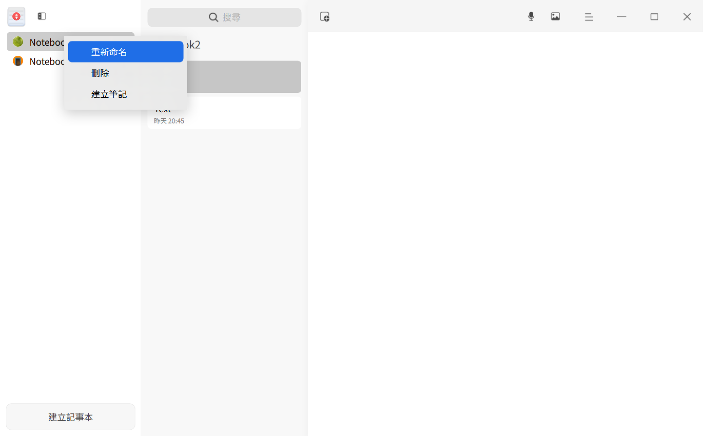
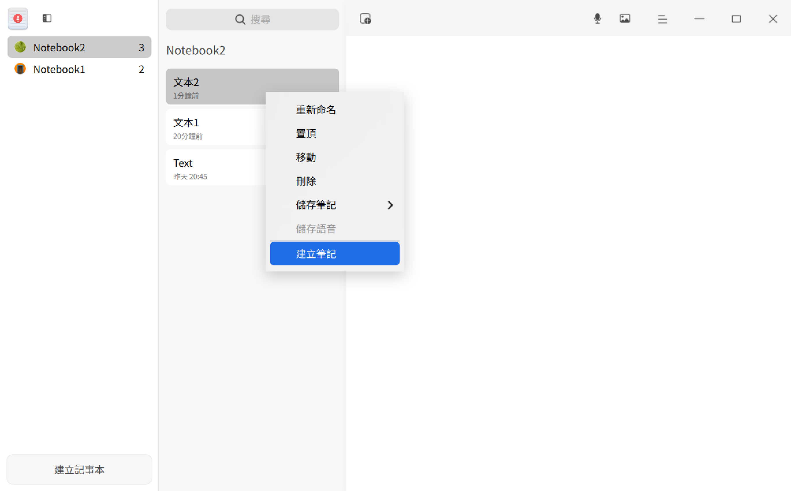
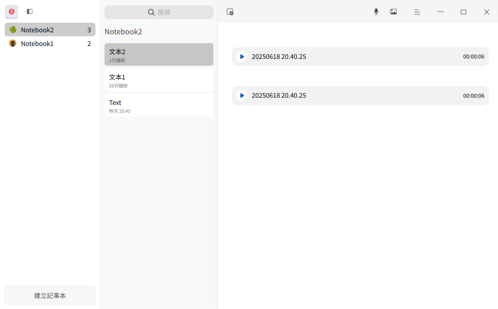
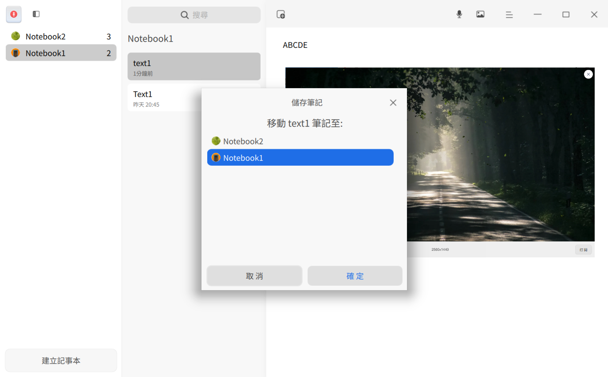
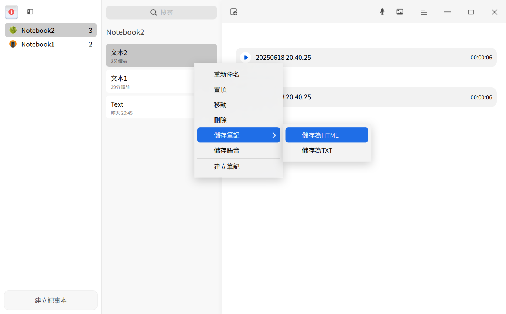
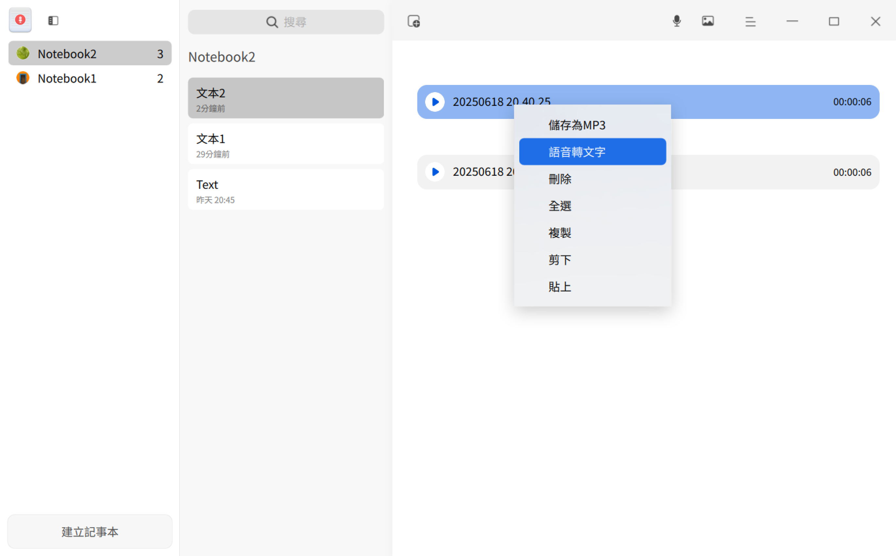

# 語音記事本|deepin-voice-note|

## 概述

語音記事本是一款整合語音與文字的記事軟體，常用於記錄日常生活或工作事項。

## 使用入門

執行、關閉語音記事本或建立捷徑。

### 執行語音記事本

1. 點選工作列啟動器圖示 ，進入啟動器介面。
2. 滾動滑鼠或搜尋，找到語音記事本圖示 ，點選執行。
3. 右鍵點選 ，您可以：
   - 點選 **傳送到桌面**，建立桌面捷徑。
   - 點選 **釘選到工作列**，固定應用程式至工作列。
   - 點選 **開機自動啟動**，加入開機啟動項。

### 關閉語音記事本

- 點選介面  結束。
- 工作列右鍵點選  > **全部關閉**。
- 點選  > **結束**。

### 檢視快速鍵

使用快速鍵 **Ctrl + Shift + ?** 開啟預覽介面。熟練使用可提升效率。

## 記事本管理

### 新增記事本

- 無記事本時，點選 **新增記事本** 建立。
- 記事本列表下方點選 **新增記事本** 建立。

>  秘訣：拖曳記事本調整順序；點選  隱藏/顯示列表。

### 重新命名記事本

1. 雙擊記事本或右鍵選擇 **重新命名**。
2. 輸入新名稱。
3. 點選空白處或按 **Enter** 確認。

### 刪除記事本

1. 選中記事本。
2. 右鍵 > **刪除** 或按 **Delete**。
3. 彈窗確認。

## 筆記管理

### 新增筆記

- 首次建立記事本後，系統自動建立筆記。點選  新增。
- 右鍵記事本/筆記 > **新增筆記**。

#### 新增文字至筆記

1. 選中筆記。
2. 點選詳細資訊區輸入文字。
3. 選中文字使用格式工具：字型、大小、顏色、粗體等。

#### 新增語音至筆記

1. 選中筆記。
2. 點選錄音按鈕 。
3. 點選  完成錄音（最長60分鐘）。
   
   >  注意：點選  暫停； 繼續。
4. 點選  播放。

#### 新增圖片至筆記

新增圖片方式：
- 點選  > 選擇圖片。
- 拖曳圖片至詳細資訊區。
- 複製貼上圖片。

### 重新命名筆記

1. 雙擊筆記或右鍵 > **重新命名**。
2. 輸入新名稱。
3. 點選空白處或按 **Enter**。

### 搜尋筆記

1. 點選搜尋框 。
2. 輸入關鍵字按 **Enter**。
3. 點選  清除/取消搜尋。

### 移動筆記

選中單個/多個筆記 (Ctrl/Shift)，然後：
- 拖曳至另一記事本。
- 右鍵 > **移動** > 選擇目標記事本。

### 置頂筆記

1. 右鍵筆記。
2. 選擇 **置頂**。

   右鍵已置頂筆記 > **取消置頂**。

### 儲存筆記

1. 選中單個/多個筆記。
2. 右鍵 > **儲存筆記** > **儲存為HTML** 或 **儲存為TXT**。

   > 注意：
   >- TXT：儲存文字/語音元資料（無音訊/圖片）。
   >- HTML：儲存文字/圖片（無音訊）。

### 儲存語音

1. 選中單個/多個語音筆記。
2. 右鍵 > **儲存語音**（儲存為MP3）。

>  秘訣：右鍵單個語音檔案 > **儲存為MP3**。

### 語音轉文字

1. 選中語音檔案。
2. 右鍵 > **語音轉文字**（轉換為文字）。

### 文字轉語音

1. 選中文字 > 右鍵 > **文字轉語音**。
2. 點選關閉按鈕  停止。

> 注意：
>- 未選中文字時功能停用。
>- 僅適用已轉換文字（非原始音訊）。

### 語音聽寫

1. 放置游標 > 右鍵 > **語音聽寫**（語音轉文字）。
2. 點選關閉按鈕  停止。

> 秘訣：可與錄音同時使用。

### 刪除筆記

1. 選中單個/多個筆記。
2. 右鍵 > **刪除** 或按 **Delete**。
3. 彈窗確認。

### 刪除語音

1. 選中語音檔案。
2. 右鍵 > **刪除** 或按 **Delete**。

## 主選單

設定音源、檢視隱私權政策、切換佈景主題、檢視幫助等。

### 設定

設定音源：
- **系統聲音**：僅錄製系統內建音訊。
- **麥克風聲音**：僅錄製麥克風輸入。

1. 點選 。
2. 選擇音源。

### 隱私權政策

1. 點選 。
2. 選擇 **隱私權政策** 檢視。

### 佈景主題

切換佈景主題（淺色/深色/系統）：
1. 點選 。
2. 選擇 **佈景主題**。

### 幫助

檢視幫助手冊：
1. 點選 。
2. 選擇 **幫助**。

### 關於

檢視版本/資訊：
1. 點選 。
2. 選擇 **關於**。

### 結束

結束語音記事本：
1. 點選 。
2. 選擇 **結束**。