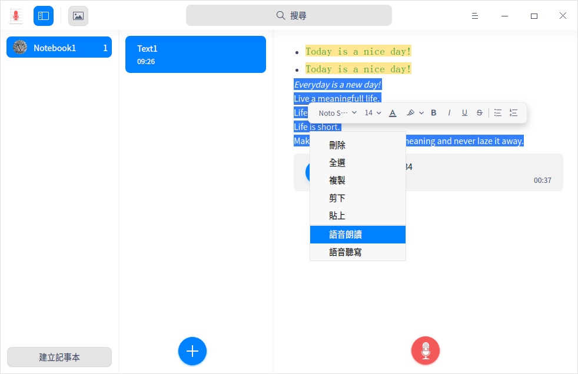

# 語音記事本|deepin-voice-note|

## 概述

語音記事本是一款集語音、文字於一體的記事軟體，一般用來記錄生活日常或工作事項。

## 使用入門

透過以下方式執行、關閉語音記事本，同時還可以建立捷徑。

### 執行語音記事本

1. 單擊任務欄上的啟動器圖示 ，進入啟動器介面。
2. 上下滾動滑鼠滾輪瀏覽或透過搜尋，找到語音記事本 單擊執行。
3. 右鍵單擊 ，您可以：

   - 單擊 **建立桌面捷徑**，在桌面建立捷徑。
   - 單擊 **釘選到Dock**，將應用程式固定到Dock。
   - 單擊 **開機啟動**，將應用程式添加到開機啟動項，在電腦開機時自動執行該應用。

### 關閉語音記事本

- 在語音記事本介面單擊 ，關閉語音記事本。
- 在任務欄右鍵單擊 ，選擇 **全部關閉** 關閉語音記事本。
- 在語音記事本介面單擊 ，選擇 **離開** 關閉語音記事本。

### 查看快捷鍵

使用快捷鍵 **Ctrl + Shift + ?** 打開快捷鍵預覽介面。熟練地使用快捷鍵，將大大提升您的操作效率。

## 操作介紹

### 建立記事本

- 當語音記事本中尚無記事本時，單擊 **建立記事本**，建立一個新的記事本。
- 在記事本列表下方，單擊 **建立記事本**，建立一個新的記事本。

竅門：您可以在記事本列表中拖曳記事本調整順序。

### 建立筆記

- 當第一次建立記事本後，系統預設建立一個筆記，在筆記列表內單擊  按鈕可繼續建立新的筆記。
- 右鍵單擊記事本或筆記，選擇 **建立筆記** 建立一個新筆記。

### 添加文字筆記

1. 在筆記列表中，選擇一個筆記。
2. 將游標移入右側詳情頁內，單擊滑鼠左鍵後輸入文字筆記。

###  添加語音

1. 在語音記事本介面上，選擇一個筆記。

2. 在右側詳情頁內單擊 ，添加語音。

3. 單擊  按鈕完成語音錄製。

   > 說明：添加語音的過程中您可以單擊  按鈕暫停錄音，再次單擊  按鈕繼續錄音。錄音的限制時長為60分鐘。

4. 錄製完成後，單擊  播放按鈕可以重播語音。

### 搜尋

1. 在語音記事本頂部搜尋框中，單擊 ，輸入關鍵字。
2. 按下鍵盤上的 **Enter** 鍵搜尋結果。
3. 在搜尋文字框中單擊  清除目前輸入的關鍵字或取消搜尋。

### 置頂筆記

1. 在筆記列表中，右鍵單擊筆記。

2. 選擇 **置頂**，該筆記會排在筆記列表最前面。

   右鍵單擊已置頂的筆記，選擇 **取消置頂**。

### 移動筆記

在某記事本的筆記列表中，選擇一個筆記或按下 **Ctrl/Shift** 鍵選擇多個筆記，可以採用以下方法之一移動筆記。

- 按住滑鼠左鍵將筆記拖曳到另一個記事本中。
- 單擊滑鼠右鍵選擇 **移動**，在彈出的對話框中選擇一個記事本，單擊 **確定**，該筆記會移到所選的記事本中。

### 語音轉文字

1. 在語音記事本介面上，選擇一個語音文件。
2. 單擊滑鼠右鍵選擇 **語音轉文字**。

### 儲存語音

1. 在筆記列表中，選擇一個語音筆記或按下 **Ctrl/Shift** 鍵選擇多個語音筆記。
2. 單擊滑鼠右鍵，選擇 **儲存語音**，選中的語音筆記則儲存至儲存裝置中。

> 竅門：您也可以選擇語音筆記中某一個語音文件，右鍵單擊選擇 **儲存為MP3** ，該語音文件則儲存至儲存裝置中。

### 儲存為TXT文件

1. 在筆記列表中，選擇一個文字筆記或按下 **Ctrl/Shift** 鍵選擇多個文字筆記。
2. 單擊滑鼠右鍵，選擇 **儲存為TXT**，選中的文字筆記則儲存至儲存裝置中。

### 語音朗讀

在「控制中心」 > 「輔助功能」中開啟語音朗讀後，可執行以下操作。

1. 在語音記事本介面選中一段文字，單擊滑鼠右鍵選擇 **語音朗讀**，語音播報選中的文字。
2. 在語音朗讀模式下，右鍵單擊選擇 **停止朗讀** 或者單擊左鍵停止朗讀。
   >說明：
   >- 當未選中文字時，語音朗讀呈置灰狀態，不可操作。
   >- 當只選中語音文件時，語音朗讀不可操作；若語音文件已轉為文字，可進行語音朗讀的操作。

### 語音聽寫

在「控制中心」 > 「輔助功能」中開啟語音聽寫並選擇語言後，可執行以下操作。

1. 在語音記事本介面右側詳情頁內，單擊滑鼠右鍵選擇 **語音聽寫**，透過麥克風輸入語音，轉譯文字將被編輯在詳情頁內。
2. 在聽寫模式下單擊介面空白區域停止語音聽寫。

>竅門：錄製語音時可同時開啟語音聽寫的功能。

### 文本翻譯

在「控制中心」 > 「輔助功能」中開啟文字翻譯並選擇語言後，可執行以下操作。

1. 在語音記事本介面選中一段文字。
2. 單擊滑鼠右鍵選擇 **文本翻譯**，選中的文字將被翻譯成目標語言。

>說明：當只選中語音文件時，文字翻譯不可操作；若選中的語音文件包含語音轉文字內容，可進行文字翻譯的操作。

### 重新命名記事本

建立記事本後，將自動命名為「記事本（n）」，您可以重新命名記事本。

1. 在記事本介面上，右鍵單擊記事本。
2. 選擇 **重新命名**。
3. 輸入新的名稱。
4. 單擊介面空白處或者按下鍵盤上的 **Enter** 鍵完成重新命名。

> 竅門: 您也可以對記事本下的各個筆記進行重新命名。

### 刪除記事本

1. 在記事本列表中，選擇一個記事本。
2. 單擊滑鼠右鍵選擇 **刪除**或按下鍵盤上的**Delete**鍵。
3. 在彈出的對話框中，單擊 **確定**。

### 刪除筆記

1. 在筆記列表中，選擇一個筆記或按下 **Ctrl/Shift** 鍵選擇多個筆記。
2. 單擊滑鼠右鍵選擇 **刪除**或按下鍵盤上的**Delete**鍵。
3. 在彈出的對話框中，單擊 **確定**。

### 刪除語音

1. 在語音記事本介面上，選擇一個語音文件。
2. 單擊滑鼠右鍵選擇 **刪除**或按下鍵盤上的**Delete**鍵。
3. 在彈出的對話框中，單擊 **確定**。

## 主選單

在主選單中，您可以設定聲音來源、查看隱私政策、切換視窗主題、查看說明手冊，了解語音記事本的更多訊息。

### 設定

您可對聲音來源進行設定，包含系統聲音和麥克風聲音。

1. 在語音記事本介面，單擊 。
2. 設定聲音來源：
   - 選擇 **系統聲音**，錄音時只錄製系統內建聲音。
   - 選擇 **麥克風聲音**，錄音時只錄製麥克風聲音。

### 隱私政策

1. 在語音記事本介面，單擊 。
2. 選擇 **隱私政策**，打開隱私政策連結並查看相關內容。

### 主題

視窗主題包含亮色主題、暗色主題和系統主題。

1. 在語音記事本介面，單擊 。
2. 單擊 **主題**，選擇一個主題顏色。

### 說明

查看說明手冊，進一步了解和使用語音記事本。

1. 在語音記事本介面，單擊 。
2. 單擊 **說明**。
3. 查看語音記事本的說明手冊。

### 關於

1. 在語音記事本介面，單擊 。
2. 單擊 **關於**。
3. 查看語音記事本的版本和介紹。

### 離開

1. 在語音記事本介面，單擊  。
2. 單擊 **離開**。

